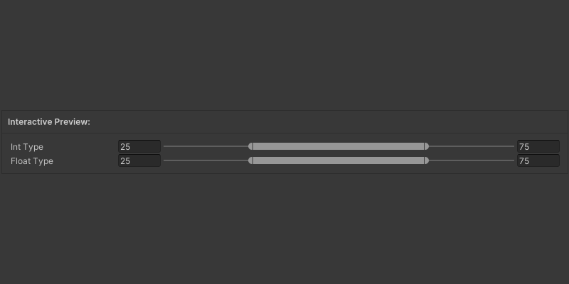

# Indent


This attribute can be used only with: <mark style="color:$primary;">**Vector2**</mark>, <mark style="color:$primary;">**Vector2Int**</mark>


### <i class="fa-eye">:eye:</i>  Attribute Preview

<div data-with-frame="true"><figure><figcaption></figcaption></figure></div>

<p align="center"><sup><mark style="color:$primary;">Min Max Slider</mark></sup> <sup><mark style="color:$primary;">Attribute</mark> adds a Description to the Tooltip Informing About the Set Attributes</sup></p>

### <i class="fa-square-code">:square-code:</i>  Code

```csharp
[MinMaxSlider(0, 100)]
public Vector2Int IntType = new Vector2Int(25, 75);

[MinMaxSlider(0, 100)]
public Vector2 FloatType = new Vector2(25, 75);
```

### <i class="fa-gears">:gears:</i>  Parameters

&#x20;  <mark style="color:$danger;background-color:$danger;">**REQUIRED**</mark>**&#x20;     ValueName**\
<sup><mark style="color:$info;">Lorem Ipsum dolor sit amen, concenterus adispincing elit.<mark style="color:$info;"></sup>

&#x20;  <mark style="color:$primary;background-color:$primary;">**OPTIONAL**</mark>**&#x20;     ValueName**\
<sup><mark style="color:$info;">Lorem Ipsum dolor sit amen, concenterus adispincing elit.<mark style="color:$info;"></sup>

&#x20;  <mark style="color:$primary;background-color:$primary;">**OPTIONAL**</mark>**&#x20;     ValueName**\
<sup><mark style="color:$info;">Lorem Ipsum dolor sit amen, concenterus adispincing elit.<mark style="color:$info;"></sup> [<sup><mark style="color:$info;">Color Palette<mark style="color:$info;"></sup>](../../editors/color-palette-window.md)

### <i class="fa-list-timeline">:list-timeline:</i>  Change History



## Version 1.0.0a

* Attribute Added


