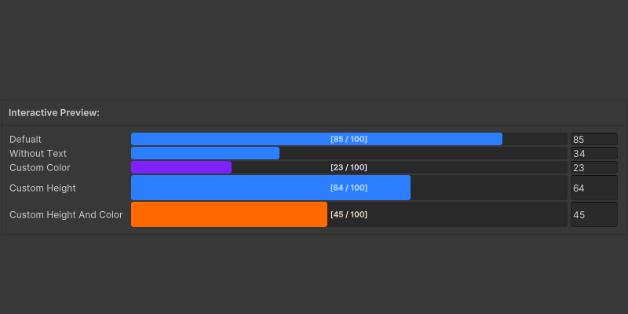

# Progress Bar

### <i class="fa-eye">:eye:</i>  Attribute Preview

<div data-with-frame="true"><figure><figcaption></figcaption></figure></div>

<p align="center"><sup><mark style="color:$primary;">Progress Bar Attribute</mark> uses the color settings from the Color Palette Window</sup> <sup>to customize the appearance.</sup></p>

### <i class="fa-square-code">:square-code:</i>  Code

```csharp
[ProgressBar(0, 100)]
public int Defualt = 75;

[ProgressBar(0, 100, false)]
public float WithoutText = 75;

[ProgressBar(0, 100, TinyInspectorColor.Purple)]
public int CustomColor = 75;

[ProgressBar(0, 100, 32)]
public float CustomHeight = 75;

[ProgressBar(0, 100, 32, TinyInspectorColor.Orange)]
public int CustomHeightAndColor = 75;
```

