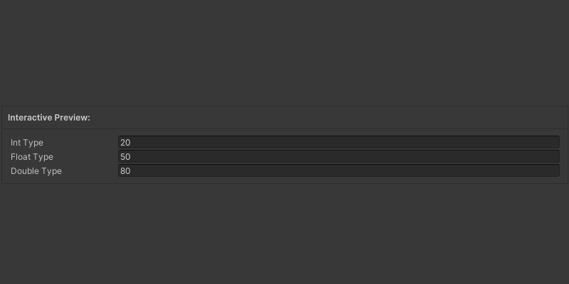

# Wrap

### <i class="fa-eye">:eye:</i>  Attribute Preview

<div data-with-frame="true"><figure><figcaption></figcaption></figure></div>

<p align="center"><sup><mark style="color:$primary;">Wrap Attribute</mark> adds a Description to the Tooltip Informing About the Set Attributes</sup></p>

### <i class="fa-square-code">:square-code:</i>  Code

```csharp
[DisplayAsString]
public string DisplayAsString1 = "DisplayAsString w/o Label";

[DisplayAsString(TinyIcon.Mana)] 
public string DisplayAsString3 = "DisplayAsString Icon w/o Label";

[DisplayAsString(true)] 
public string DisplayAsString2 = "DisplayAsString with Label";

[DisplayAsString(true, TinyIcon.Mana)] 
public string DisplayAsString4 = "DisplayAsString Icon with Label";
```
