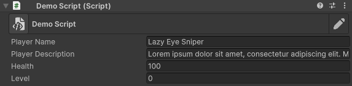
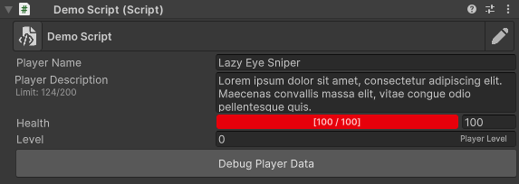

# How to Use



### Open the desired script

Open the script to which you want to add new attributes in the editor


```c#
using UnityEngine;

public class DemoScript : MonoBehaviour
{
    public string PlayerName;
    public string PlayerDescription;

    public int Health;
    public int Level;

    public void DebugPlayer()
    {
        // ...
    }
}
```




### Import Tiny Inspector

To use Tiny Inspector in your script, add the following directive at the top of your C# file&#x20;

<pre class="language-c#" data-title="DemoScript.cs"><code class="lang-c#">using UnityEngine;
<strong>using TinyInspector;
</strong>
public class DemoScript : MonoBehaviour
{
    public string PlayerName;
    public string PlayerDescription;

    public int Health;
    public int Level;

    public void DebugPlayer()
    {
        // ...
    }
}
</code></pre>



### Add selected attributes

Now you can add attributes from Tiny Inspector to your script.

<pre class="language-c#" data-title="DemoScript.cs"><code class="lang-c#">using UnityEngine;
using TinyInspector;

public class DemoScript : MonoBehaviour
{
    public string PlayerName;
<strong>    [MultilineTextArea(3, 200)]
</strong>    public string PlayerDescription;

<strong>    [ProgressBar(0, 100, Color: TinyColor.Red)]
</strong>    public int Health;
<strong>    [Suffix("Player Level")]
</strong>    public int Level;

<strong>    [Button("Debug Player Data")]
</strong>    public void DebugPlayer()
    {
        // ...
    }
}
</code></pre>



<p align="center">Final Effect</p>

<div><figure><figcaption><p>Script without attributes</p></figcaption></figure> <figure><figcaption><p>Script with attributes</p></figcaption></figure></div>
